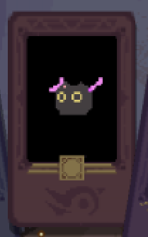

# 🌊 理智之锚：在疯狂深渊中的喘息

在黑暗仪式的侵蚀下，理智如风中残烛。这些卡牌将成为你在疯狂深渊中宝贵的锚点，助你在痛苦与疯狂之间找到脆弱的平衡。

---

## 🃏 新增理智相关卡牌

### 荧光棒猫猫 (Glowstick Kitty)

- **类型：** 光环牌

- **技能效果：**
  
  - 当任意仪式牌即将为敌人增加基础痛苦时，使其**额外增加25点基础痛苦**
  
  - 同时**恢复玩家1点理智**

- **描述：** "在无尽黑暗中，那抹荧光与柔软的触感，是唯一能让我保持清醒的存在。"

### 泪 (Tear)

- **类型：** 光环牌

- **技能效果：**
  
  - 当玩家理智降低时（每次降低时触发）
  
  - **恢复5点理智**
  
  - **抽一张牌**

- **描述：** "每一滴滑落的泪珠，都洗去一丝疯狂，带来新的希望。"

### 鲸落 (Whalefall)

- **类型：** 仪式牌

- **耐久：** 20

- **技能效果：**
  
  - 当被触发时，将当前所有耐久值**平均分配给其他所有仪式牌**
  
  - 耐久分配完成后，**玩家恢复30点理智**
  
  - 此牌耐久变为0

- **描述：** "巨鲸陨落，滋养万物。以自我毁灭为代价，换取他人的生存与清醒。"

---

## 💡 策略组合提示

- **绝望中的希望：** 当理智濒临崩溃时，【鲸落】可以一次性提供大量理智恢复，同时增强其他仪式牌的生存能力，堪称逆转局势的王牌。

- **痛苦与清醒的循环：** 【荧光棒猫猫】既能增强痛苦输出，又能稳定恢复理智，特别适合与多段触发的痛苦流派配合，实现伤害与生存的双重保障。

- **疯狂的馈赠：** 【泪】将理智降低这一负面效果转化为补充手牌和恢复的机会。在不得不承受理智伤害的场合，这张牌能帮你将危机转化为机遇。

- **终极救赎组合：** 在理智极低时，先触发【鲸落】恢复大量理智并强化场面上其他仪式牌，随后通过【荧光棒猫猫】和【泪】的效果维持理智健康，构建可持续发展的战斗体系。

---

> 记住：最黑暗的时刻，往往只需一丝光明就足以改变一切。明智地使用这些卡牌，它们或许不能让你完全摆脱疯狂，但至少能让你在深渊中多坚持一会儿。
