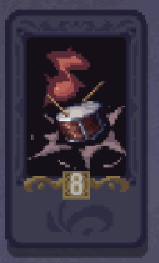

# 🕸️ 诡术操纵：新增傀儡卡牌与无尽痛楚链

以无形丝线操控战局，用诡秘术法编织毁灭的终局。

---

## 🃏 新增核心仪式牌

### 操偶 (The Puppetmaster)

- **类型：** 仪式牌

- **技能效果：**
  
  1. **痛苦丝线：** 为敌人增加 **8点** 基础痛苦
  
  2. **傀儡召唤：** 召唤一只**傀儡**，继承操纵者除本技能外的全部技能

- **描述：** "灵魂为偶，痛苦为线，一切皆在掌控之中。"

### 傀儡 (Soulbound Marionette)

- **类型：** 衍生仪式牌（由操偶召唤）

- **固有技能：**
  
  - **+8基础痛苦** 加成效果
  
  - **耐久耗尽或返回牌库时永久移除**
  
  - 继承操纵者的其他所有技能

- **描述：** "没有自我，唯有服从，直至消亡。"

---

## 🎭 新增辅助仪式牌

### 二重奏 (Echoing Duet)

- **类型：** 仪式牌

- **技能效果：**
  
  1. **痛苦旋律：** 为敌人增加 **5点** 基础痛苦
  
  2. **无尽回响：** 本回合中，**其他技能**额外触发一次

- **描述：** "一声痛苦，两声回响，直至永恒。"

---

## ⚡ 新增魔法牌

### 下咒 (Malefic Transfer)

- **类型：** 魔法牌（一次性消耗）

- **效果：** 将目标仪式牌的**随机一个技能**转移给其**右侧相邻的牌**

- **描述：** "力量不过是可以交易的货币，而痛苦是最通用的货币。"

---

## 🎯 终极诡术连锁

通过精妙的技能操纵，构建令人战栗的痛苦引擎：

1. **技能嫁接：** 使用【下咒】将【二重奏】的【无尽回响】转移给【操偶】

2. **双重召唤：** 触发【操偶】的【傀儡召唤】，在【无尽回响】作用下**连续召唤两次**

3. **完美傀儡：** 每个傀儡继承：
   
   - 【痛苦丝线】（8基础痛苦）
   
   - 【无尽回响】（其他技能额外触发一次）
   
   - 固有【+8基础痛苦】加成

4. **痛苦爆发：** 傀儡触发技能时造成：
   
   - 单次伤害：`(8 + 8) × 2 = 32点` 基础痛苦
   
   - 双重傀儡：`32 × 2 = 64点` 基础痛苦

---

> 小心操纵，谨慎布局，让每一根丝线都编织着敌人毁灭的命运。
