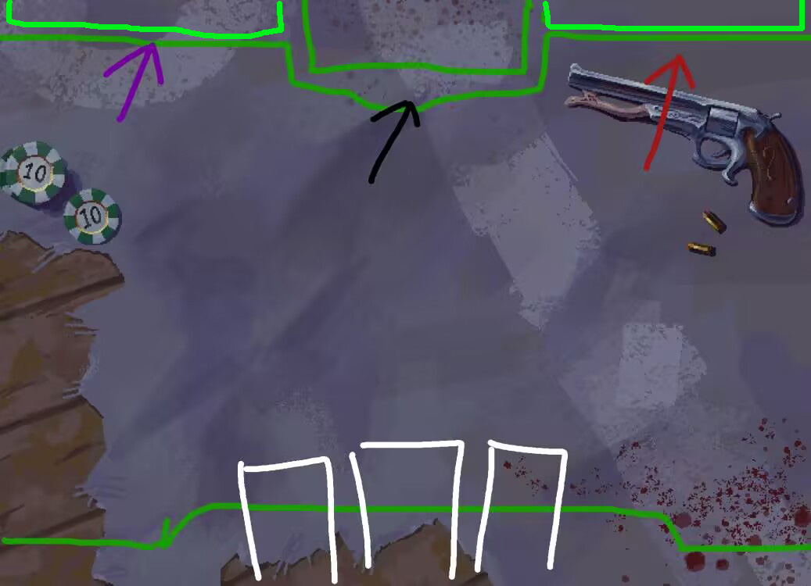

# 🎮 《暗夜仪式》关卡UI需求文档

**文档目的：** 明确游戏主关卡场景的UI布局、元素与风格需求  
**核心风格：** 暗黑、诡秘、带有宗教仪式感，与游戏整体美术风格统一

---

## 一、 整体布局与结构

主关卡UI整体分为上下两大主要区域，呈**对称结构**，形成玩家与怪物的对峙感。

---

## 二、 怪物区 (Enemy Area) - 顶部

### 1. 区域形状

- 一个横贯屏幕的**长条状面板**，宽度与游戏背景宽度一致。

- 轮廓要求：**中间高，左右两侧低**，

### 2. 核心元素

- **中央：怪物头像**
  
  - **内容：** 当前怪物的艺术头像。
  
  - **位置：** 位于区域最高处。

- **头像下方：痛苦值显示**
  
  - **内容：** 数字显示，格式为 `可承受痛苦` (如：`1000`)。

### 3. 回合痛苦结算区

- **左侧 (紫色纹路)：**
  
  - **功能：** 显示**本回合怪物新增的基础痛苦**。
  
  - **视觉：** 左侧区域背景融入紫色能量、符文或血管状的纹路。

- **右侧 (红色纹路)：**
  
  - **功能：** 显示**本回合怪物痛苦的放大倍数**。
  
  - **视觉：** 右侧区域背景融入红色、灼烧感或裂纹状的纹路。

---

## 三、 玩家区 (Player Area) - 底部

### 1. 区域形状

- 与顶部怪物区**对称**，同样是中间高、左右两侧低的横条面板。

- 与怪物区上下呼应，形成完整的“仪式场”视觉效果。

### 2. 核心元素

- **中央：手牌区**
  
  - **功能：** 玩家当前手牌的展示区域。
  
  - **需求：** 无需复杂UI，只需一个**平坦、深色的背景区域**，用于清晰地展示卡牌本身。可稍有透明感。

- **左侧：理智值显示**
  
  - **功能：** 清晰显示玩家的当前理智值。
  
  - **形式：** 可采用 **“图标+数字”** 的组合形式。
  
  - **风格：** 进度条设计需符合主题（如：脑波仪、灵魂烛火、沙漏、腐蚀的刻度等）。
  
  - **状态变化：** 需考虑高理智与低理智状态下的**颜色或形态变化**（如：高为蓝色/银色，低为红色/闪烁）。

---

## 四、 交付要求

1. **切图：** 提供关键静态元素的透明背景PNG切图。

2. **命名规范：** 文件命名清晰，如 `ui_top_enemy_bar.png`, `ui_enemy_hp_text.png`, `ui_player_sanity_bar_bg.png`, `ui_player_sanity_bar_fill.png`。

## 五、 风格参考

- **材质：** 老旧皮革、腐蚀金属、磨砂玻璃、能量蚀刻。

- **色彩：** 深黑、暗金、古铜色为底，搭配紫色（基础痛苦）、红色（倍率痛苦）、蓝色（理智）作为功能色。

- **感觉：** 神秘、古老、略微不适但又引人探究。

---

请优先完成**怪物区**和**玩家区**的背景面板设计，我们将以此为基础进行程序搭建。谢谢！
